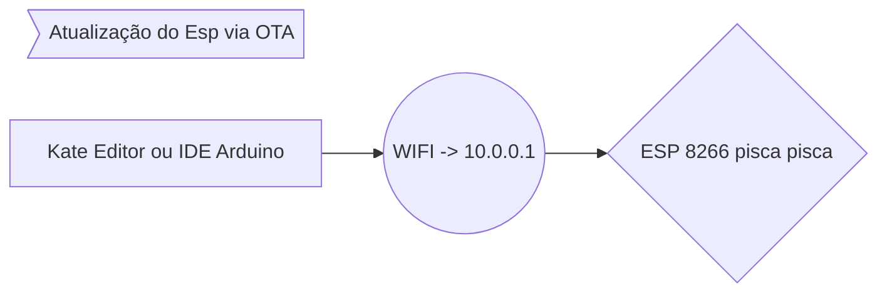
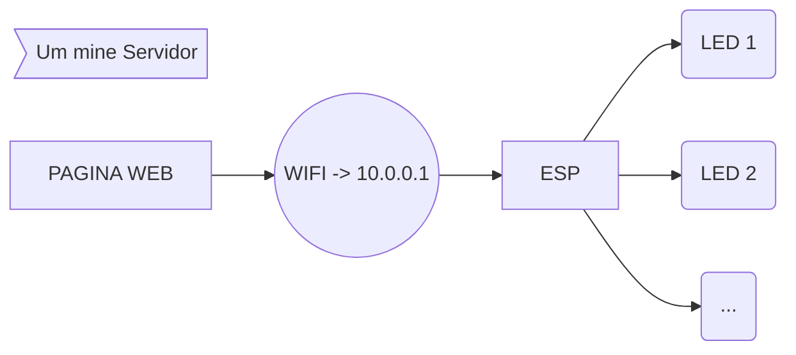
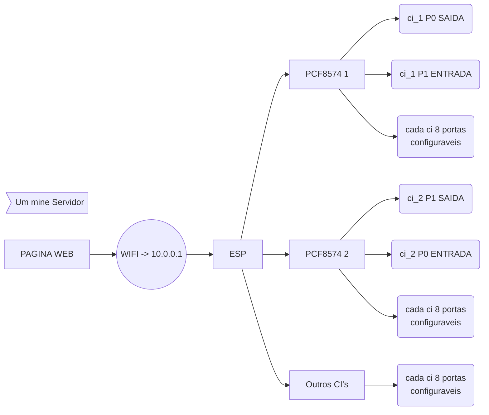
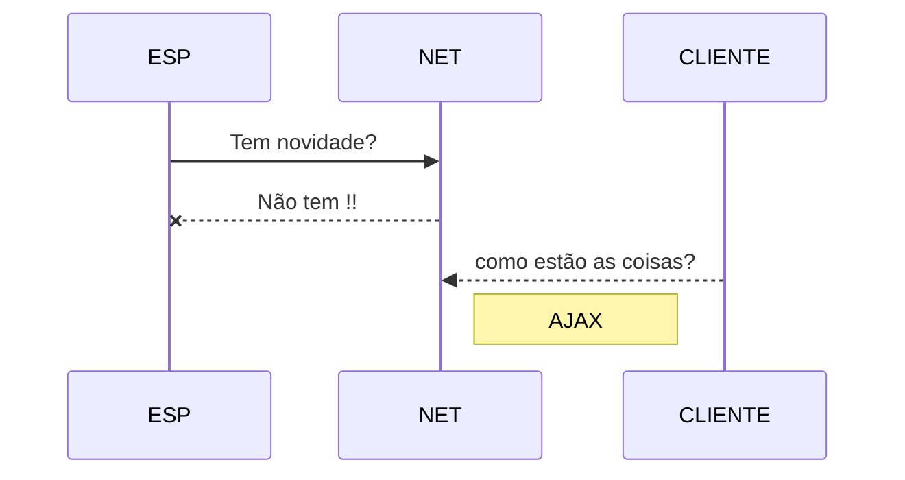

#  AppCasa Automação
Esse pequeno projeto de automação tem por objetivo a simplicidade de subir um código ou binário via ip OTA, na realidade o ESP 8266 enviar notificações via bot telegram, e o controle remoto via internet sem bibliotecas, com isso você pode ampliar o leque de recursos e usabilidades que podemos falar, e ate mesmo mostrar em videos futuros..

# [1_pisca_pisca](https://github.com/Condiolov/AppCasa/tree/main/1_pisca_pisca "1_pisca_pisca")

Passo a passo de como fazer o upload do binário via IP OTA (atualização remota de software) usando o Kate Editor ou a IDE do proprio Arduino para ESP 8266, um pisca pisca apenas para saber se o ESP esta funcionando, se o Código esta subindo, se esta tudo ok.

video 1: https://youtu.be/TgQbt1ys-FA

video 2: https://youtu.be/9wk9-3_aoyo ( AppCasa 1 - Pisca Pisca via ip OTA usando Kate Editor)

# [2_uma_lampada](https://github.com/Condiolov/AppCasa/tree/main/2_uma_lampada "2_uma_lampada")

Criando um mine web servidor com ESP 8266 capaz de acionar um led e futuramente uma lampada ou algo bem superior. Ao acessar o ip do ESP (no meu caso o 10.0.0.101) você verá uma pagina web que é a inteface basica que pode ser modificada e criada de acordo com suas espectativas. Nesse video explico cada funcionalidade, uma delas é o coração função que faz o ESP ficar picando, para mostrar seu funcionamento, bem como servir de led sinalizador de atividade.

video 3: https://youtu.be/al7JYiOS6YU ( AppCasa 2 - Web servidor com ESP 8266 capaz de acionar um LED)

# [3_entradas_saidas]
AppCasa 3 - Expansor de Entras e Saida para o ESP 8266 scanear endereço do ci PCF8574, conseguimos ampliar para mais dispositivos o controle do espectativas

## Em breve

 - [x] 1_pisca_pisca ( Kate -> OTA -> ESP (pisca pisca)
 - [x] 2_uma_lampada (Acionar via LED acessando ESP como servidor WEB)
 - [x] 3_entrada_saidas (Expansão)
 - [ ] 4_
 - [ ] 5_
 - [ ] 6_
 - [ ] 7_

> **Note:** Inscreve no canal muita coisa legal!!

htps://stackedit.io/app
