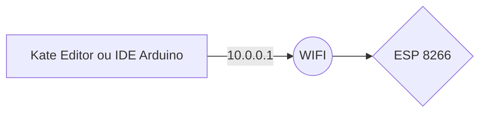
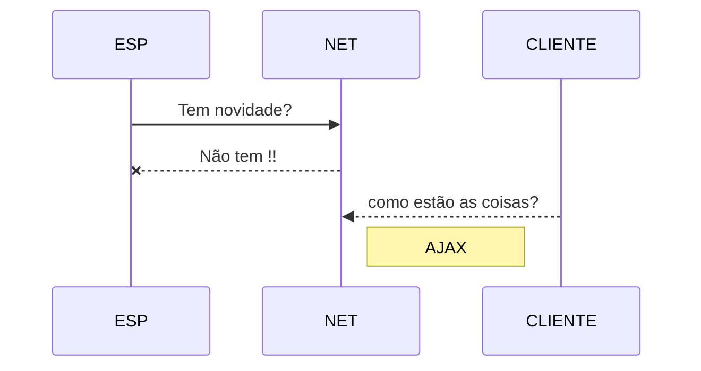

#  AppCasa Automação
Esse pequeno projeto de automação tem por objetivo a simplicidade de subir um código ou binário via ip OTA, a enviar notificações via bot telegram, e o controle remoto via internet sem bibliotecas, com isso você pode ampliar o leque de recursos e usabilidades que podemos falar ate mesmo mostrar em videos futuros..

# [1_pisca_pisca](https://github.com/Condiolov/AppCasa/tree/main/1_pisca_pisca "1_pisca_pisca")

Passo a passo de como fazer o upload do binário via IP OTA usando o Kate Editor ESP 8266, um pisca pisca apenas para saber se o ESP esta funcionando, se o codigo esta subindo, se esta tudo ok.

video 1: https://youtu.be/TgQbt1ys-FA

video 2:

## Em breve

 - [x] 1_pisca_pisca ( Kate -> OTA -> ESP (pisca pisca)
 - [ ] 2_
 - [ ] 3_
 - [ ] 4_
 - [ ] 5_
 - [ ] 6_
 - [ ] 7_

> **Note:** Inscreve no canal muita coisa legal!! 

htps://stackedit.io/app
